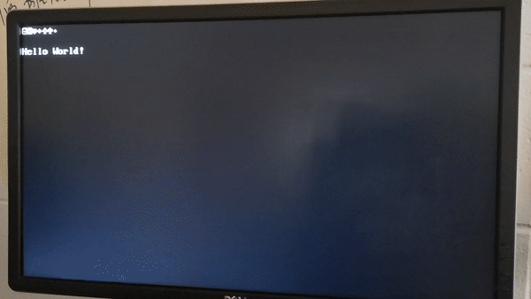

# SOC1 implementing...

Currently, soc1 is composed cpu6, ram, vga controller, timer, uart.


* Cpu6 is a RISC-V core that has four-stage pipeline. IFID, EX, MEM, WB.

    * RV32I: addi add sub beq bne bltu blt bgeu bge jalr jal lui auipc andi and ori or sltiu slti sltu slt xori xor 
             sw lw lh lhu lb lbu slli srli srai sll srl sra
            
             Except for fence, ecall and ebreak.  
    
    (lh lhu lb lbu only supports 4-byte aligned access. lh 2-byte alighed access and lb 1-byte aligned access can be 
    implemented through exception. Need misaligned exeception though)
    
    
    * Zicsr:  csrrw csrrs csrrc csrrwi csrrsi csrrci

    * CSR registers: mepc mtvec mstatus mie mip

    


* No cache, 2-port SRAM 64KB

* Video RAM 64KB, 640 x 480, 25MHz

* Timer0  (mtime mtimecmp)

* UART0   (115200 8n1) 

  Need to enable interrupt and external interrupt in mstatus and mie, respectively.

````````````
        8:              005001b3;  --           add x3 x0 x5
        9:              30419073;  --           csrrw x0 mie x3 (csrw mie rs) ; enable external interrupt
        a:              0ff00193;  --           addi x3 x0 0x8    ; enable interrupt
        b:              30019073;  --           csrrw x0 mstatus x3 (csrw mstatus rs)
````````````

## Exceptions
* illegal instruction


## Interrupts

* Timer interrupt

* UART interrupt


## Vectors
* Reset: 0x00000000

* Trap:  0x00000004


## Memory Map

```````````````
    0x0  +------------+
         |            |
         |    RAM     |  64KB
         |            |
         |            |
 0xffff  |            |
0x10000  +------------+
         | Text RAM   |2KB
0x107ff  +------------+   
         |            |  64KB
         | Reserved   |
         | Graphic RAM| 
0x20000  +------------+         0x20000  RW   mtime      (64-bit register, now only use low 32-bit)
         |            |         0x20008  RW   mtimecmp   (64-bit register, now only use low 32-bit)
         |            |  64KB
         | Device MMIO|         0x21000  RW   uartdr     (32-bit register, 
         |            |                                   low 8 bits are used to transmit and receive data)
0x2ffff  |            |
         +------------+
         |            |
         |            |
         .....
```````````````

## VGA Text Mode

* 640x480 70Hz 

* 80x25 screen

* 2KB Vidoe RAM

* 8x16 pixels per character

* 127 ASCII characters


## VGA Graphic Mode

* 640x480 60Hz

* 4 pixels as one big pixel

* 64KB Video RAM

* 8 colors


## Directory Structure

`````````````````
soc1
├── doc  		# Documents of simulation test cases
├── README.md
├── simulation          # Simulation test cases, using modelsim
├── soc			# Rtl code	
├── systhesis           # \altera\makefile                  
└── tb			# Testbench files for simulation test cases
`````````````````

## Compile
`````````````
cd systhesis/altera
make
`````````````
 (or make map)

## Run simulation tests
```````````````
cd simulation
./run_all_test.sh
```````````````

test2_addi_cpu_clk_initial_1 is supposed to fail. Others are not.

See doc/test*.md for details


## Game
### Tic-Tac-Toe
Play the game through the serial port.
`````````
$ sudo screen /dev/ttyUSB0 115200 
`````````


### SpaceInvaders
First, send the binary through uart. Don't press any key into the terminal.

The soc1_bootloader loads the first 2KB input as the binary.

In screen terminal:
````````
Ctrl-A + :
:readreg p /home/uty/prjs/soc1prjs/spaceinvaders/space.bin

Ctrl-A + :
:paste p
````````

