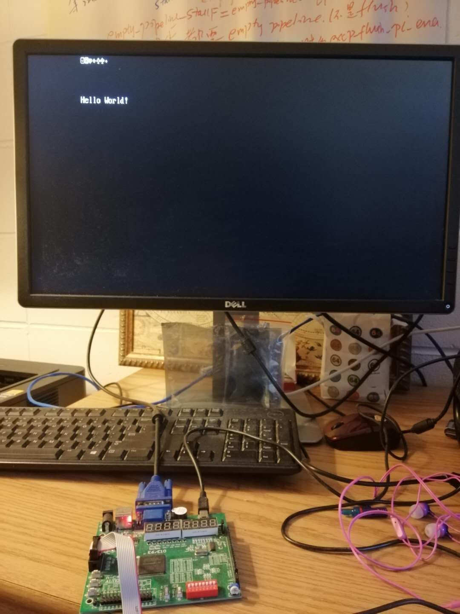
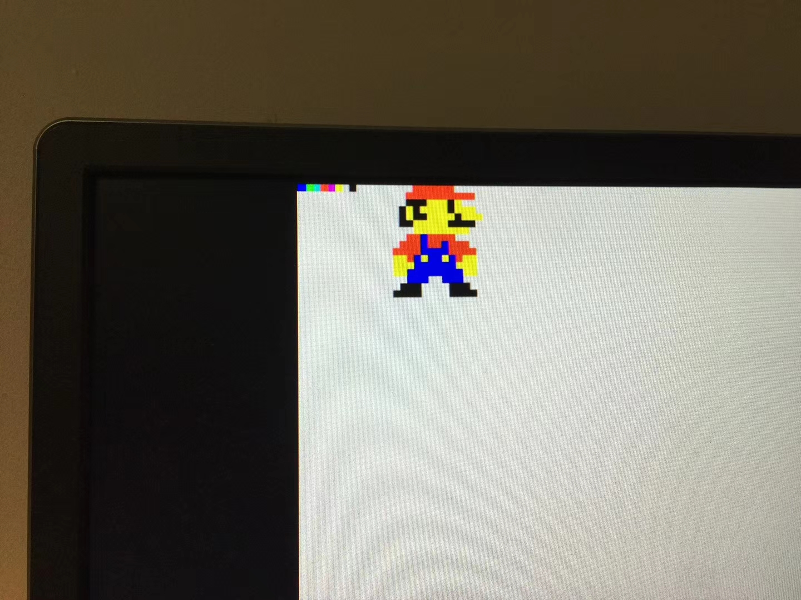

# soc1 implementing...

Currently, soc1 is composed cpu6, ram, vga controller, timer, uart.


* Cpu6 is a RISC-V core that has four-stage pipeline. IFID, EX, MEM, WB.

    * RV32I: lw sw addi add sub beq bne jalr ... implementing 
    
    * CSR instructions:  csrrw csrrs csrrc csrrwi csrrsi csrrci

    * CSR registers: mepc mtvec mie mip

    


* No cache, 2-port RAM. 64KB

* Video RAM 64KB  640 x 480  25MHz

* Timer0  (mtime mtimecmp)

* UART0   (9600 8n1)

# Exception 
illegal instruction


# Interrupts

* Timer interrupt

* UART interrupt


# Vectors
* Reset: 0x00000000

* Trap:  0x00000004


# Memory Map

```````````````
    0x0  +------------+
         |            |
         |    RAM     |  64KB
         |            |
         |            |
 0xffff  |            |
0x10000  +------------+
         | Text RAM   |2KB
0x107ff  +------------+   
         |            |  64KB
         | Reserved   |
         | Graphic RAM| 
0x20000  +------------+         0x20000  RW   mtime      (64-bit register, now only use low 32-bit)
         |            |         0x20008  RW   mtimecmp   (64-bit register, now only use low 32-bit)
         |            |  64KB
         | Device MMIO|         0x21000  RW   uartdr     (32-bit register, low 8 bits are used to transmit and receive data)
         |            |
0x2ffff  |            |
         +------------+
         |            |
         |            |
         .....
```````````````

# VGA Text Mode

* 640x400 70Hz 

* 80x25 screen

* 2KB Vidoe RAM

* 8x16 pixels per character

* 127 ASCII characters




# VGA Graphic Mode

640x480 60Hz

4 pixels as one big pixel

64KB Video RAM

8 colors



# Directories

`````````````````
soc1
├── doc  		# Documents of simulation test cases
├── README.md
├── simulation          # Simulation test cases, using modelsim
├── soc			# Rtl code	
├── systhesis           # \altera\makefile                  
└── tb			# Testbench files for simulation test cases
`````````````````

# Compile
`````````````
cd systhesis/altera
make
`````````````
 (or make map)

# Run simulation tests
```````````````
cd simulation
./run_all_test.sh
```````````````

test2_addi_cpu_clk_initial_1 is supposed to fail. Others are not.

see doc/test*.md for details


# Game
Tic-Tac-Toe

