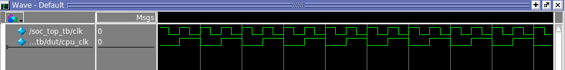
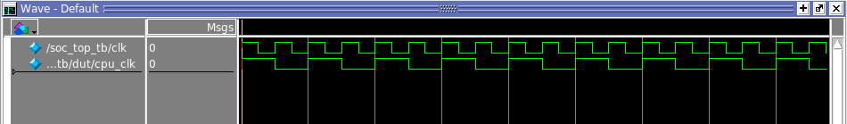
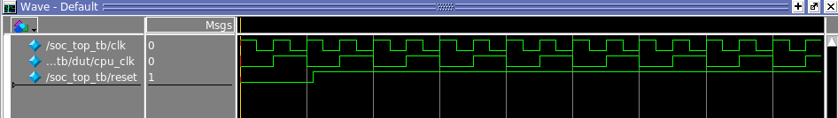
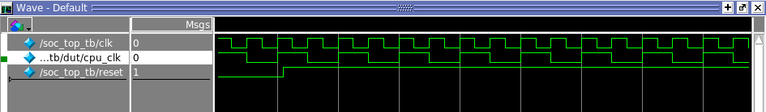

## cpu_clk in testbench

The FPGA development board used is C4E6E10 which has a Cyclone IV E EP4CE6E22C8. Its pin 23 provides 50MHz clock.

50MHz clk is too fast for this design. Runs at 25Mhz is fine.

This is simply done as the following code:
`````````````
        reg cpu_clk;
        reg vga_clk;

        always @(posedge clk)
        begin
                cpu_clk = ~cpu_clk;
                vga_clk = ~vga_clk;
        end

`````````````

This works on FPGA because cpu_clk is either 0 or 1.
But in testbench, in simulation, cpu_clk and vga_clk don't have initial values.
So they are x all the time.

Hence, in testbenches, set initial value.

````````````````
    // initialize test
    initial
    begin
      $display("Start ...");
        dut.cpu_clk = 0;
        dut.vga_clk = 0;
        reset <= 0; #22; reset <= 1;
    end

    // generate clock to sequence tests
    always
    begin
        clk <= 1; #5 ;clk <= 0; #5;
    end
````````````````

When the initial value of dut.cpu_clk is 1, the cpu_clk and clk looks like this.




test1_addi is a very simple test.

**ram.mif**
``````````````````````````
CONTENT BEGIN

        0:              00100293;  --           addi x5 x0 1
        1:              00200293;  --           addi x5 x0 2
        2:              00300293;  --           addi x5 x0 3
        3:              00400293;  --           addi x5 x0 4
        4:              00500293;  --           addi x5 x0 5


        [5..7FF]  :   00000013; -- nop
END;

``````````````````````````


The result is a little weird.

````````````
# Start ...
# -
# reset 0
# cpu_clk 0
# pc 00000000
# vga_rgb xxx
# reg[5] 00000000
# +
# -
# reset 1
# cpu_clk 0
# pc 00000000
# vga_rgb xxx
# reg[5] 00000000
# +
# -
# reset 1
# cpu_clk 0
# pc 00000004
# vga_rgb xxx
# reg[5] 00000000
# +
# -
# reset 1
# cpu_clk 0
# pc 00000008
# vga_rgb xxx
# reg[5] 00000000
# +
# -
# reset 1
# cpu_clk 0
# pc 0000000c
# vga_rgb xxx
# reg[5] 00000001
# +
# -
# reset 1
# cpu_clk 0
# pc 00000010
# vga_rgb xxx
# reg[5] 00000001    <---
# +
# -
# reset 1
# cpu_clk 0
# pc 00000014
# vga_rgb xxx
# reg[5] 00000002
# +
# -
# reset 1
# cpu_clk 0
# pc 00000018
# vga_rgb xxx
# reg[5] 00000003
# +
# -
# reset 1
# cpu_clk 0
# pc 0000001c
# vga_rgb xxx
# reg[5] 00000004
# +
# -
# reset 1
# cpu_clk 0
# pc 00000020
# vga_rgb xxx
# reg[5] 00000005
````````````

Notice when pc is 0x08, reg[5] loads 0x1.
Because of the 4-stage pipeline implementation, that's when the Writeback stage executed for the first instruction.

But at pc 0x10, the reg[5] is still 0x1. It should be 0x2.

--------------------
When set
`````````` 
dut.cpu_clk = 1;
``````````
The clk and cpu_clk is the following:



And the result is:

``````````````
# Start ...
# +
# -
# reset 0
# cpu_clk 0
# pc 00000000
# vga_rgb xxx
# reg[5] 00000000
# +
# -
# reset 1
# cpu_clk 0
# pc 00000004
# vga_rgb xxx
# reg[5] 00000000
# +
# -
# reset 1
# cpu_clk 0
# pc 00000008
# vga_rgb xxx
# reg[5] 00000000
# +
# -
# reset 1
# cpu_clk 0
# pc 0000000c
# vga_rgb xxx
# reg[5] 00000000
# +
# -
# reset 1
# cpu_clk 0
# pc 00000010
# vga_rgb xxx
# reg[5] 00000001
# +
# -
# reset 1
# cpu_clk 0
# pc 00000014
# vga_rgb xxx
# reg[5] 00000002
# +
# -
# reset 1
# cpu_clk 0
# pc 00000018
# vga_rgb xxx
# reg[5] 00000003
# +
# -
# reset 1
# cpu_clk 0
# pc 0000001c
# vga_rgb xxx
# reg[5] 00000004
# +
# -
# reset 1
# cpu_clk 0
# pc 00000020
# vga_rgb xxx
# reg[5] 00000005
``````````````

----------------------------
I noticed both times the core finished the program when cpu is 0x00000020.
The first run actually 1 cycle earier loads 0x1 into reg[5].

cpu6_core only uses cpu_clk, so I guess this is because of reset pin. 

---------------------------

Better show them with reset signal





Looks like the first run runs ahead 1 clock cycle, that means the first instruction is one stage ahead in the pipeline.
But, the PC didn't move forward. So in the piple line, in the first case, the first instruction fill twice in the pipeline. 
