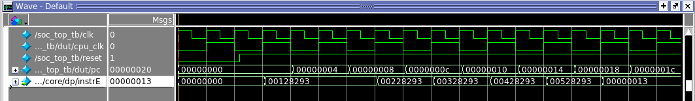
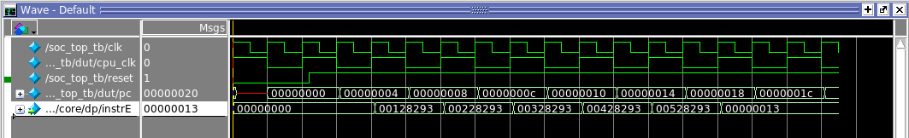

## when release reset signal matters 


**test2 code**

``````````````````````````````
CONTENT BEGIN

	0:		00128293;  --		addi x5 x5 1
	1:		00228293;  --		addi x5 x5 2
	2:		00328293;  --		addi x5 x5 3
	3:		00428293;  --		addi x5 x5 4
	4:		00528293;  --		addi x5 x5 5


	[5..7FF]  :   00000013; -- nop
END;
``````````````````````````````
Let's debug. Monitor instrE in the pipeline. It holds the instruction for EX stage.

**cpu_clk 1**


**cpu_clk 0**



00128293 stays in instrE longer in the first run. It crosses two rising edge.
So it get executed twice.


Assume x5 is zero in the begining, the simulation result shows that 1+2+3+4+5 
executes to 16.


```````````````````````
# Start ...
# -
# reset 0
# cpu_clk 0
# pc 00000000
# vga_rgb xxx
# reg[5] 00000000
# +
# -
# reset 1
# cpu_clk 0
# pc 00000000
# vga_rgb xxx
# reg[5] 00000000
# +
# -
# reset 1
# cpu_clk 0
# pc 00000004
# vga_rgb xxx
# reg[5] 00000000
# +
# -
# reset 1
# cpu_clk 0
# pc 00000008
# vga_rgb xxx
# reg[5] 00000000
# +
# -
# reset 1
# cpu_clk 0
# pc 0000000c
# vga_rgb xxx
# reg[5] 00000001
# +
# -
# reset 1
# cpu_clk 0
# pc 00000010
# vga_rgb xxx
# reg[5] 00000002
# +
# -
# reset 1
# cpu_clk 0
# pc 00000014
# vga_rgb xxx
# reg[5] 00000004
# +
# -
# reset 1
# cpu_clk 0
# pc 00000018
# vga_rgb xxx
# reg[5] 00000007
# +
# -
# reset 1
# cpu_clk 0
# pc 0000001c
# vga_rgb xxx
# reg[5] 0000000b
# +
# -
# reset 1
# cpu_clk 0
# pc 00000020
# vga_rgb xxx
# reg[5] 00000010
# test2_addi_cpu_clk_initial_1 simulation FAILED
``````````````````````````
