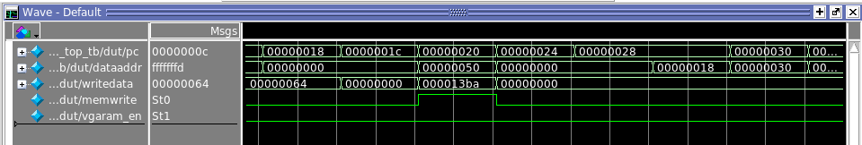

## use most of the instructions

Because of pipeline, the reg update at current + 3 + 1 cycle.

**Code:**

```````````````````````````````
CONTENT BEGIN

	0:		00000293;  --		addi x5 x0 0
	1:		00000313;  --		addi x6 x0 0
	2:		06400393;  --		addi x7 x0 100

-- <loop>:
	3:		00130313;  --		addi x6 x6 1
	4:		006282b3;  --		add x5 x5 x6
	5:		fe731ce3;  --		bne x6 x7 -8 <loop>
	6:		04502823;  --		sw x5 80(x0)
	7:		00000013;  --		nop
	8:		00000013;  --		nop
	9:		01800113;  --		addi x2 x0 24
	a:		018100e7;  --		jalr x1 x2 24
	b:		00000013;  --		nop
	c:		05000293;  --		addi x5 x0 80
	d:		0012a223;  --		sw x1 4(x5)
	e:		ffc00313;  --		addi x6 x0 -4
	f:		406282b3;  --		sub x5 x5 x6
	10:		0012a423;  --		sw x1 8(x5)

-- <halt>:	
	11:		00000013;  --		nop
	12:		00000013;  --		nop
	13:		fe000ee3;  --		beq x0 x0 -8 <halt>


	[14..7FF]  :   00000013; -- nop
END;
`````````````````````````````

**Result:**


**cpu_clk 1**


**cpu_clk 0**

