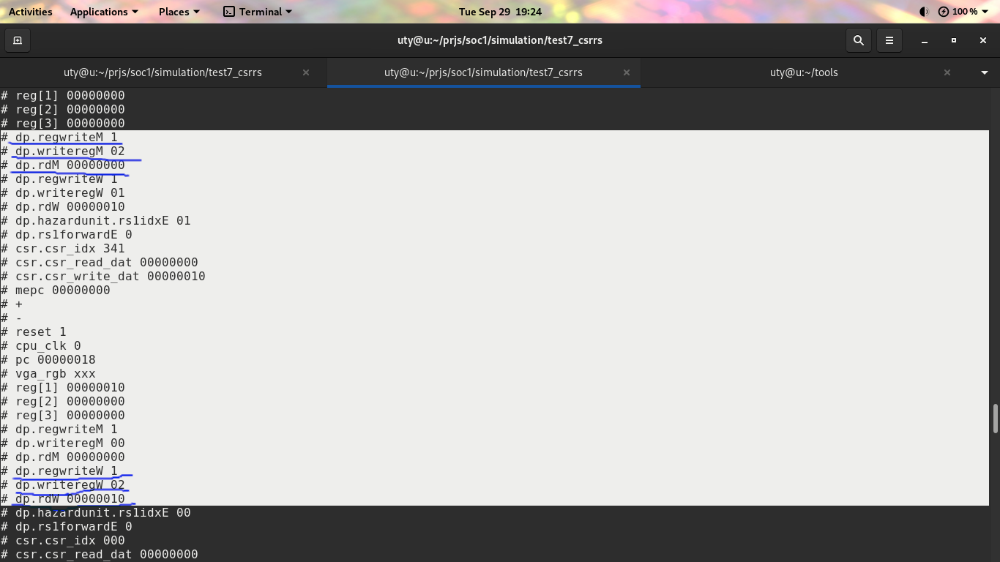
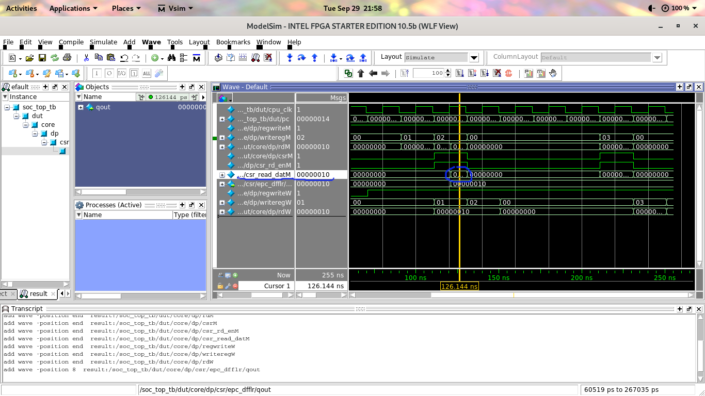

## test for csrrs instruction

It is a simple test case just like the one with csrrw.
```````````````
CONTENT BEGIN

        0:              00000013;  --           nop
        1:              00000013;  --           nop
        2:              01000093;  --           addi x1 x0 16
        3:              3410a173;  --           csrrs x2 mepc x1
        4:              00000013;  --           nop
        5:              00000013;  --           nop
        6:              00000013;  --           nop 
        7:              00000013;  --           nop
        8:              341021f3;  --           csrrs x3 mepc x0 (csrr rd mepc)
        9:              00000013;  --           nop
        a:              00000013;  --           nop
        b:              00000013;  --           nop
        c:              00000013;  --           nop
        d:              00000013;  --           nop
        e:              00000013;  --           nop

-- <loop>:
        f:              00000063;  --           beq x0 x0 0 <loop>

        [10..7FF]  :   00000013; -- nop
END;
```````````````
The problem is the following:

In the second csrrs instruction, I changed rd from x2 to x3.

x2 gets the value of mepc from the first csrrs instruction, it should be 0x0. But it turns out that x2 becomes 0x10.

So I put more output to trace the issue.



```````````````
dp.regwriteM 1
dp.writeregM 02
dp.rdM 00000000
`````````````````
It indicates that write 0x0 to reg[2], which is correct
Since it is a writting to the general registers, so it is should be done in WB stage.
This three signals are pass forward through pipeline.

But in the next cycle,  dp.rdW becomes 00000010

Later, found out, it's because MEM-WB pipeline register works at the falling edge. The rdM changed due to csr_read_datM.



The root cause of this bug is that the read and write to the csr register act at the same time.

``````````````
module cpu6_csr (
   input  clk,
   input  reset,

   input  csr_rd_en,
   input  csr_wr_en,
   input  [`CPU6_CSR_SIZE-1:0] csr_idx,
   output [`CPU6_XLEN-1:0] csr_read_dat,
   input  [`CPU6_XLEN-1:0] csr_write_dat
   );


   //
   // 0x341 MRW mepc  Machine exception program counter
   //
   wire sel_mepc = (csr_idx == 12'h341);
   wire rd_mepc = sel_mepc & csr_rd_en;
   wire wr_mepc = sel_mepc & csr_wr_en;
   wire [`CPU6_XLEN-1:0] epc_r;
   wire [`CPU6_XLEN-1:0] epc_nxt = {csr_write_dat[`CPU6_XLEN-1:1], 1'b0};

   cpu6_dfflr #(`CPU6_XLEN) epc_dfflr(wr_mepc, epc_nxt, epc_r, clk, reset);
   
   wire [`CPU6_XLEN-1:0] csr_mepc;
   assign csr_mepc = epc_r;


   assign csr_read_dat = `CPU6_XLEN'b0
			 | ({`CPU6_XLEN{rd_mepc}} & csr_mepc)
			    //| ({`CPU6_XLEN{rd_mtvec}} & csr_mtvec)
			    ; 

endmodule // cpu6_csr 
``````````````

When read and write to the same register at the same time, the read gets the value of the write.

Therefore, "csrrs x2 mepc x1" or "csrrw x2 mepc x1", x2 gets x1's value.

To solve this, I doubled the cpu6_dfflr register, adding a prev_qout_r to store the previous value of this register.

The current write value will be updated in the next clock.

```````````````
module cpu6_2x_dfflr # ( parameter DW = 32) (
	input  lden,
	input  [DW-1:0] dnxt,
	output [DW-1:0] qout,
	input  clk,
	input  rst
);
        reg [DW-1:0] prev_qout_r;
	reg [DW-1:0] qout_r;
	
	always @(posedge clk or posedge rst)
	begin : dffl_proc
		if (rst == 1'b1)
		begin
		        prev_qout_r <= {DW{1'b0}};
			qout_r <= {DW{1'b0}};
		end   
		else if (lden == 1'b1)
		begin
		        prev_qout_r <= #1 qout_r;
			qout_r <= #1 dnxt;
		end
	        else
		        prev_qout_r <= #1 qout_r;	
	end
	
	assign qout = prev_qout_r;

endmodule // cpu6_2x_dfflr
```````````````

I am not sure if this is a good way to solve the problem.

Another option is to put the write into the next pipeline stage (WB).
But this may need to handle data harzard.

Now csr register will be updated one cycle late. From ip+2(MEM) to ip+3(WB).

