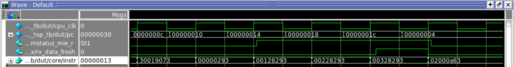
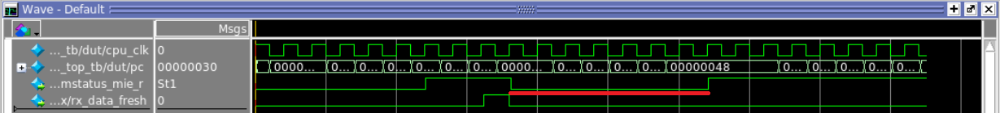
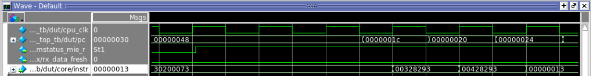
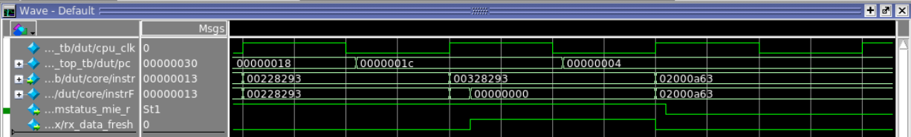
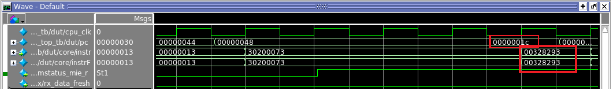

Press arrow keys too fast or keep pressing easily freeze the game.

1. No mstatus.mie for global interrupt enabling.It also used to
guarantee atomicity with respect to interrupt handlers.  The
interrupt reenters and corrupts the registers used by the previous
trap handler.

Add mstatus CSR register. mstatus.mie can be accessed through CSR
instruction. When interrupt enable, once timer or uart interrupts
raise, set mstatus.mie to 0; when mret returns back to faulting pc,
set mstatus.mie back to 1.

test20_mstatus_mie is for that.

2. The exception is different from interrupt. When resuming from
the trap handler, the core re-executes the faulting pc for the
exception.  For trap instruction such as ebreak and ecall, it
should continue at faulting-pc + 4.

For interrupt, it depends on the implementation. The return address
may not be faulting-pc + 4. When an external interrupt comes, the
instruction it hits could be anyone. For example, the current
instruction could be a beq, so that the next instruction after it
may not be +4.

In cpu6, mret returns to faulting-pc. There is another problem that
the faulting instruction executes twice. test21_add1to4_interrupt
addresses this problem.  It first enables interruption by setting
mstatus.mie to 1, then "addi x5, x0, 1", "addi x5, x0, 2", "addi
x5, x0, 3", "addi x5, x0, 4". Set interrupt during these
instructions. If the faulting instruction executes twice, the sum
will be wrong.

To solve this, the instruction fetched will be set to NOP if the
mstatus.mie is set to 1 and either tmr_irq_r or ext_irq_r is
signaled, so that the current instruction becomes NOP or a buble in
the pipeline. It will be actually executed when mret return to it.


### test21_add1to4_interrupt
````````````
CONTENT BEGIN

	0:		00000463;  --		beq x0 x0 8 <reset>
	1:		02000a63;  --		beq x0 x0 52 <trap>

--  <reset>:
	2:		0ff00193;  --		addi x3 x0 0x8    ; enable interrupt
	3:		30019073;  --		csrrw x0 mstatus x3 (csrw mstatus rs)
	4:		00000293;  --		addi x5 x0 0
	5:		00128293;  --		addi x5 x5 1
	6:		00228293;  --		addi x5 x5 2
	7:		00328293;  --		addi x5 x5 3
	8:		00428293;  --		addi x5 x5 4
	9:		00000013;  --		nop
	a:		00000013;  --		nop
	b:		00000013;  --		nop
	c:		00000013;  --		nop

--  <loop_in_rest>:
	d:		00000063;  --		beq x0 x0 0 <loop_in_rest>

--  <trap>:
	e:		00000013;  --		nop
	f:		00000013;  --		nop
	10:		00000013;  --		nop
	11:		00000013;  --		nop
	12:		30200073;  --		mret

	[13..7FF]  :   00000000;

END;
````````````

In the test bench, interrupt is added.

### test21_add1to4_interrupt_soc_top_tb.v
``````````````
   // initialize test
   initial
      begin
	 $display("Start ...");
	 dut.cpu_clk = 0;
	 dut.vga_clk = 0;
	 reset <= 0; #22; reset <= 1;
	 dut.u_uart.urx.rx_data_fresh <= 0; #140; dut.u_uart.urx.rx_data_fresh <= 1;
      end
``````````````



For test20, the following image shows mstatus_mie_r works fine. It is 0 until the CSR instruction enables it and then it becomes 0 during the trap handler.



### Interrupt: re-execute the faulting instruction
The interrupt happens when the pc is 0x0000001c. The trap vectors is at 0x0000004.

After the trap handler finished, where the last instruction is mret at 0x00000048, the processor resumes at 0x0000001c.

The problem is that 0x0000001c executes twice. The instruction is 00328293, which is *addi x5 x5 3*.




### Solution
In cpu6_core, thi following code solves the issue.

``````````
   // for interrupt, after trap handler, the faulting pc will be re-executed
   // so here, since the instruction is already fetched, 
   // Replace it with NOP
   assign instrF = (csr_mstatus_mie_r & (tmr_irq_r | ext_irq_r)) ? `NOP : instr;
``````````
If the global interrupt is enabled, during timer or external interrupt, It replaces the fetched instruction with NOP, which is 32'h00000000.

Therefore, this instruction will not be executed, even though it is already fetched.

Why is it already fetched? Because in cpu6, the pcF, which is the instruction address, is generated half a cycle earlier than the IFID stage (falling edge). When the clock positive edge comes, the instruction will be fetched from the SRAM, and the combinational logic works afterward.

In the following two images, the pc value 0000001c still shows twice; one before 00000004, the other after 00000048. However, the instruction *instrF* is 0000000 in the former.




