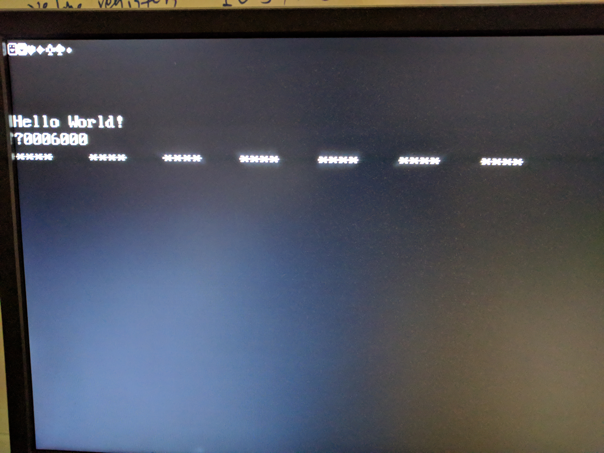

## SoC1 Timer

The timer is the first peripheral device implemented in the soc1. It is part of the RISC-V core because some of the registers are documented in the specification as  Control and Status Register (CSR).

Currently, soc1 has **mtime**, **mtimecmp**, **mie**, and **mip** that are related to timer. The **mtime** and **mtimecmp** are MMIO registers, and they are located at 0x20000 and 0x200008, respectively. They are both 64-bit registers, but now, for simplicity, only 32 bits are used. The **mtime** increments one on every clock, which is the same frequency as the core. 

In the specification, "A timer interrupt becomes pending whenever mtime contains a value greater than or equal to mtimecmp, treating the value as unsigned integers. The interrupt remains posted until mtimecmp becomes greater than mtime (typically as a result of writing mtimecmp). The interrupt will only be taken if interrupts are enabled and the MTIE bit is set in the mie register."

However, in this way, there is one problem need to solve. When the timer interrupt is triggered, **MTIP** remains posted until writing to **mtimecmp** or **mtime** to make **mtimecmp** bigger, and the writing MMIO should be part of the trap routine. However, this may trigger the trap on every subsequent clock cycle. There should be another status bit that indicates the trap routine is already invoked so that no reentrance. Then instruction mret clears this bit.

The **MTIP** only asserts when **mtime** equals **mtimecmp** only trigger one time for the current implementation. If not disabling MTIE or resetting mtimecmp, the timer will go off when mtime overflow and restart from zero.

The timer interrupt is treated as an exception. In module **cpu6_excp**, asserts IRQ when both **tmr_irq_r** and **csr_mtie_r** are valid.
``````````
   wire irq_req_raw = (
	               (tmr_irq_r & csr_mtie_r)
	              //| (ext_irq_r & csr_meie_r)
	);
``````````
--------------------------------------------------------
The timer interrupt trap also goes through **excp_flush_pc**.
```````````
   assign pcnextF =
		    mret              ? csr_mepc      :
		    excp_flush_pc_ena ? excp_flush_pc :
		    pcsrcE            ? pcnextE       :
		    pcplus4F;
...
   assign stallF = (~excp_flush_pc_ena & (hazard_stallF | empty_pipeline_stallF));
   
   cpu6_dfflr#(`CPU6_XLEN) pcreg(!stallF, pcnextF, pcF, ~clk, reset);
```````````
Because in test case test19_timer, when the timer triggers, the program is looping.
``````````
loop_in_reset:
    beq x0 x0 loop_in_reset
``````````
The instruction **beq** asserts the **stallF** so that the core can stop fetch new instruction and perform a branch at the pipeline EX stage.  However, it affects **pcreg** from updating the trap vector from **excp_flush_pc**. Notice it has a higher priority than **pcnextE**, which is the branch target. 

This branch instruction will not be fully executed because of the timer interruption. The **mepc** contains the address of current instruction so that the core will re-execute it when the trap is returned by calling **mret**. 

*Need a test case for this.*

--------------------

test19_timer code

``````````````
-- Quartus II generated Memory Initialization File (.mif)

WIDTH=32;
DEPTH=2048;

ADDRESS_RADIX=HEX;
DATA_RADIX=HEX;

CONTENT BEGIN

	0:		00000463;  --		beq x0 x0 8 <reset>
	1:		08000e63;  --		beq x0 x0 156 <trap>

-- <reset>:
	2:		61002303;  --		lw x6 1552(x0) ; 0x184 data line 4, load the line 4 address in textram 
	3:		61c02283;  --		lw x5 1564(x0) ; 0x187  load Helloworld 
	4:		00532023;  --		sw x5 0(x6)
	5:		62002283;  --		lw x5 1568(x0)
	6:		00532223;  --		sw x5 4(x6)
	7:		62402283;  --		lw x5 1572(x0)
	8:		00532423;  --		sw x5 8(x6)
	9:		00000013;  --		nop
	a:		61402303;  --		lw x6 1556(x0) ; 0x185 textram line 5
	b:		62802383;  --		lw x7 1576(x0) ; load mmio mtime address 0x20000
	c:		0003a283;  --		lw x5 0(x7)    ; read mtime at address 0x20000
	d:		62c02483;  --		lw x9 1580(x0) ; load data 0x30303030, 0x30 is ascii '0'
	e:		009282b3;  --		add x5 x5 x9   ; add to the mtime value, try to show it on screen
	f:		00532023;  --		sw x5 0(x6)    ; write textram
	10:		00000013;  --		nop
	11:		00000013;  --		nop
	12:		00500293;  --		addi x5 x0 5   ; write 0x5 to mtime
	13:		0053a023;  --		sw x5 0(x7)
	14:		0003a283;  --		lw x5 0(x7)    ; read mtime again
	15:		009282b3;  --		add x5 x5 x9   ;
	16:		00532223;  --		sw x5 4(x6)    ;
	17:		00000013;  --		nop
	18:		00000013;  --		nop
	19:		63002383;  --		lw x7 1584(x0)                  ; set mtimecmp to 255
	1a:		0ff00293;  --		addi x5 x0 255
	1b:		0053a023;  --		sw x5 0(x7)
	1c:		00000013;  --		nop
	1d:		00000013;  --		nop
	1e:		304021f3;  --           csrrs x3 mepc x0 (csrr rd mie)  ; enable timer
	1f:		0ff00193;  --		addi x3 x0 255
	20:		30419073;  --		csrrw x0 mepc x3 (csrw mie rs)
	21:		304021f3;  --           csrrs x3 mepc x0 (csrr rd mie)
	22:		00000013;  --		nop
	23:		00000013;  --		nop
	24:		00000013;  --		nop            ; wait for pipeline to finish, so I can test on it
	25:		00000013;  --		nop
	26:		00000013;  --		nop

-- <loop_in_reset>:
	27:		00000063;  --		beq x0 x0 0 <loop_in_reset>

-- <trap>:
	28:		61802303;  --		lw x6 1560(x0)                  ; at textram line 6
	29:		63402283;  --		lw x5 1588(x0)                  ; show "****"
	2a:		00532023;  --		sw x5 0(x6)
	2b:		00830313;  --		addi x6 x6 5
	2c:		60602c23;  --		sw x6 1560(x0)
	2d:		30200073;  --           mret

-- <loop_in_trap>:
	2e:		00000063;  --		beq x0 x0 0 <loop_in_trap>

	[2f..17F] :     00000000;

-- <data>:

	180  :   00010000;      -- data line 0
	181  :   00010050;      -- data line 1
	182  :   000100a0;      -- data line 2
	183  :   000100f0;      -- data line 3
	184  :   00010140;      -- data line 4
	185  :   00010190;      -- data line 5
	186  :   000101e0;      -- data line 6

	187  :   6c6c6548;  -- "Hello World!"
	188  :   6f57206f;
	189  :   21646c72; 
	18a  :   00020000;  -- mmio mtime
	18b  :   30303030;  -- 0x30 ascii '0'
	18c  :   00020008;  -- mmio mtimcmp
	18d  :   2a2a2a2a;  -- ascii '****'

	[18e..7FF]  :   00000000;
  ````````````````````````````````
  
  result
 
